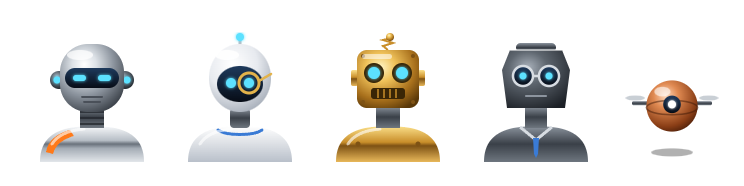
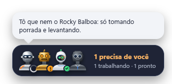
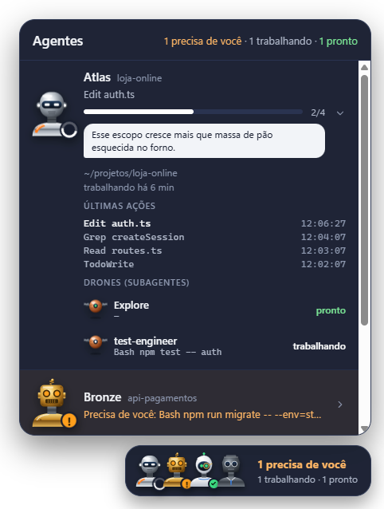
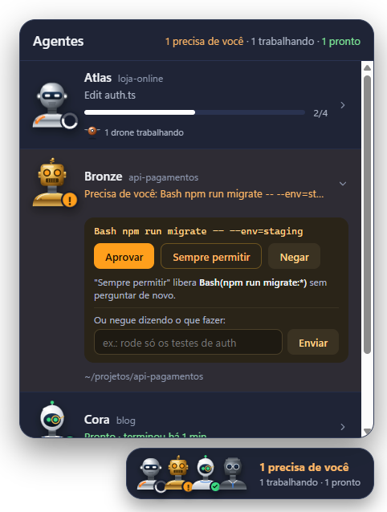

<div align="center">



# Robô Peão

**Um botão flutuante com robôs metálicos que mostra, em tempo real, o que cada agente do Claude Code está fazendo.**

Quem está trabalhando, quem terminou, quem está parado esperando você aprovar algo, e quais subagentes estão rodando. Sem ficar caçando terminal.

`terminal` · `VS Code` · `app desktop` — tudo no mesmo lugar

Feito por **Daniel Cutrim** · [Instagram @elcutrim](https://instagram.com/elcutrim) · [LinkedIn](https://www.linkedin.com/in/daniel-cutrim)

</div>

---

<table>
<tr>
<td width="50%" valign="top">

### Bateu o olho, sabe tudo
Cada sessão do Claude Code vira um robô. O botão diz em palavras o que importa: **"1 precisa de você · 1 trabalhando · 1 pronto"**.


### Eles reclamam (com razão)
A cada 2 minutos trabalhando, o robô solta uma fala sarcástica. Dá pra desligar no ícone de balão. São 120 falas no estilo "tô que nem o Rocky Balboa: só tomando porrada", e você pode escrever as suas.



</td>
<td width="50%" valign="top">

### Abre e mostra o que ele está fazendo
Ação atual, progresso, últimas ações com horário e os **drones** (subagentes) de cada agente.



</td>
</tr>
<tr>
<td valign="top">

### Aprove sem trocar de janela
Quando um agente pede permissão, o painel abre sozinho. Aprovar, sempre permitir, negar, ou negar dizendo o que fazer.

</td>
<td valign="top">



</td>
</tr>
</table>

## O que cada sinal quer dizer

O status aparece três vezes: no selo do robô, na cor dos olhos e no texto. Nada de decorar legenda.

| Selo | Olhos | Estado |
|---|---|---|
| anel branco girando | brancos | **Trabalhando** — mostra a ação atual |
| **!** laranja | laranja | **Precisa de você** — pedido de aprovação |
| **✓** verde | verdes | **Pronto** — terminou e você ainda não viu |
| nenhum | apagados | **Parado** — já viu, ou nem começou |

Fechar o painel marca os "prontos" como vistos, como mensagem lida.

| Robô | Visual |
|---|---|
| **Atlas** | cromado, viseira, faixa laranja de obra |
| **Cora** | cerâmica branca, lente de leitura dourada |
| **Bronze** | latão retrô, rebites |
| **Grafite** | metal escuro, óculos e gravata |
| **Drone** | esfera de cobre: cada subagente é um |

## Instalação

Precisa de [Node.js](https://nodejs.org) 20+ e do [Claude Code](https://code.claude.com).

```bash
git clone https://github.com/daniel-cutrim/robo-peao.git
cd robo-peao
npm install

npm run hooks:preview   # mostra o que vai entrar no ~/.claude/settings.json (não grava nada)
npm run hooks:install   # grava os hooks (faz backup do settings antes)
npm start               # abre o widget
```

Pronto: abra o Claude Code em qualquer lugar (terminal, VS Code ou app desktop) e o robô aparece no canto da tela. Sessões que já estavam abertas aparecem na próxima ação.

O widget passa a **abrir sozinho quando você liga o computador**. Pra desligar isso, clique com o botão direito no ícone do robô ao lado do relógio (no Mac, clique no robô na barra de menus) e desmarque **Abrir ao ligar o computador**.

## Controles

Passe o mouse no botão flutuante:


| | |
|---|---|
| **arrastar** | move o widget pra qualquer canto |
| **clique** | abre/fecha o painel; clique num robô pra ver os detalhes |
| 💬 **balão** | liga/desliga as falas dos robôs |
| 🔔 **sino** | silencia/ativa as notificações do sistema |
| **–** | minimiza: fica só o ícone ao lado do relógio (clique pra voltar; botão direito: Mostrar, Abrir ao ligar o computador, Sair) |
| **×** | fecha o widget |

## Aprovação pelo widget

| Opção | O que faz |
|---|---|
| **Aprovar** | libera só esta vez |
| **Sempre permitir** | libera e cria a regra sugerida pelo Claude Code (ex.: `Bash(npm test:*)`). Só aparece quando há sugestão. |
| **Negar** | bloqueia |
| **Negar dizendo o que fazer** | bloqueia e manda sua orientação pro agente |

- Perguntas de múltipla escolha e aprovação de plano não ganham botões: o widget avisa e você responde no Claude Code.
- Se você não responder no widget em 60 segundos, o Claude Code segue o fluxo normal dele.
- Widget fechado = Claude Code funciona exatamente como antes.

## Faça do seu jeito

O Robô Peão é seu: troque os robôs por personagens de anime, uma party de RPG, bichinhos, time de futebol, o que a sua criatividade permitir. Tudo é HTML, CSS e JavaScript puro, sem framework, então dá pra mexer sem medo.

| Quer mudar | Onde mexer |
|---|---|
| **As falas** | [`app/renderer/falas.js`](app/renderer/falas.js): uma fala por linha |
| **Os personagens** | [`app/renderer/robots.js`](app/renderer/robots.js): cada personagem é um desenho SVG; troque os desenhos e mantenha os olhos (`${eye}`), que mostram o status |
| **Cores e visual** | [`app/renderer/style.css`](app/renderer/style.css): as cores ficam no topo, em `:root` |
| **Ritmo das falas** | topo de [`app/renderer/app.js`](app/renderer/app.js): `SPEAK_EVERY_MS` (2 min) e `BUBBLE_MS` (7 s) |

Depois de mudar, feche e abra o widget (`npm start`).

Dica: peça pro próprio Claude Code fazer isso por você. Algo como *"transforma os robôs do Robô Peão em personagens de anime e reescreve as falas no estilo deles"* já resolve.

Hoje o widget funciona com o **Claude Code**. Suporte ao **Codex** está nos planos.

## Segurança e privacidade

- **Tudo local.** O widget escuta só em `127.0.0.1` e não faz nenhuma chamada pra internet.
- **Só o seu Claude Code entra.** A cada abertura o widget gera uma senha aleatória num arquivo da sua pasta de usuário; o relay dos hooks envia essa senha. Pedidos sem ela, ou vindos de páginas web, são recusados.
- **Aprovar só por clique.** Não existe rota HTTP que aprove algo; a decisão sai do clique no widget.
- **Nunca trava o Claude Code.** Se o widget estiver fechado ou der erro, o relay sai em silêncio.
- **Log sem conteúdo.** `events.log` (na pasta de dados do app) guarda só tipo de evento, sessão e nome da ferramenta, nunca comandos ou arquivos.
- **Atenção ao compartilhar tela:** o painel e as notificações mostram comandos e nomes de arquivo.

## Como funciona

```
Claude Code ──hooks──► hooks/relay.mjs ──POST + senha──► widget (127.0.0.1:47821)
                                                            │
                                     app/state.js (eventos → estado) ──► janela transparente
```

Usa os [hooks do Claude Code](https://code.claude.com/docs/en/hooks): `SessionStart/End`, `UserPromptSubmit`, `PreToolUse/PostToolUse`, `PermissionRequest`, `Notification`, `SubagentStart/Stop` e `Stop`.

## Desinstalar

```bash
npm run hooks:remove    # tira só os hooks deste projeto (backup antes)
```

## Limitações conhecidas

- Testado no **Windows 11**. O **macOS** tem ajustes próprios (ícone na barra de menus, sem ícone no Dock, aparece por cima de apps em tela cheia), mas ainda não foi testado numa máquina real. Linux deve funcionar, sem testes (janela transparente depende do compositor).
- No macOS, os hooks usam o caminho completo do Node. Se trocar de versão do Node (nvm), rode `npm run hooks:install` de novo.
- Sessões do Claude Code na nuvem não leem o settings local e não aparecem.
- O progresso "2/4" só aparece quando o agente usa lista de tarefas.
- Cada evento de ferramenta abre um processo Node rápido (~50–100 ms).
- A posição do botão ainda não é lembrada entre aberturas.
- Abrir ao ligar o computador foi testado só no Windows (no macOS usa `~/Library/LaunchAgents/com.robopeao.widget.plist`; no Linux ainda não existe).

## Desenvolvimento

```bash
npm test             # testes da lógica de estado (node:test)
npm run screenshots  # regenera as imagens deste README com dados de demonstração
```

Estrutura e decisões: [`CLAUDE.md`](CLAUDE.md) e [`docs/PRODUCT.md`](docs/PRODUCT.md).

## Sugestões e contribuições

Esse projeto é pra gente ir melhorando junto.

- **Tem uma ideia ou achou um problema?** Abra uma [issue](https://github.com/daniel-cutrim/robo-peao/issues) ou me chama nas redes ([@elcutrim](https://instagram.com/elcutrim) · [LinkedIn](https://www.linkedin.com/in/daniel-cutrim)).
- **Quer pôr a mão no código?** Mande um pull request. Não sabe como? O passo a passo está em [`CONTRIBUTING.md`](CONTRIBUTING.md).
- **Fez um tema próprio?** Posta e me marca. Os melhores podem virar temas oficiais.

Ideias que já estão na fila: suporte ao Codex, temas prontos para escolher, lembrar a posição do botão, testar no macOS e no Linux.

## Autor

**Daniel Cutrim**. Curtiu os robôs? Me marca quando postar o seu:

- Instagram: [@elcutrim](https://instagram.com/elcutrim)
- LinkedIn: [daniel-cutrim](https://www.linkedin.com/in/daniel-cutrim)

## Licença

[MIT](LICENSE). Projeto da comunidade, sem afiliação com a Anthropic. "Claude" e "Claude Code" são marcas da Anthropic.
